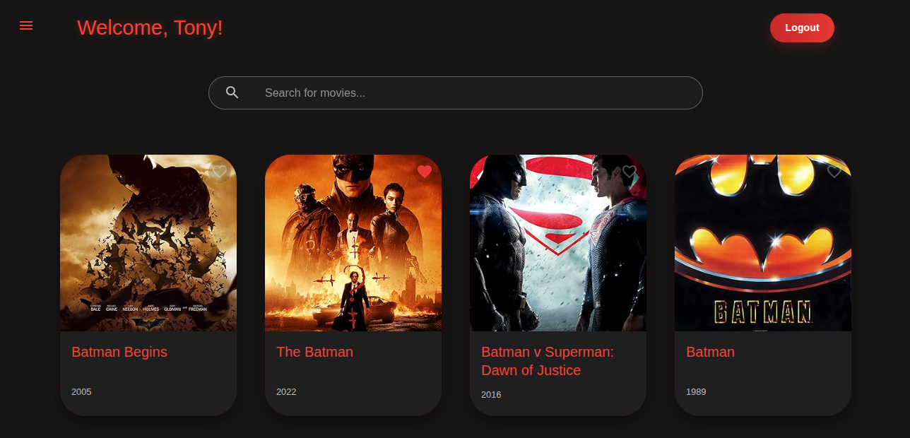
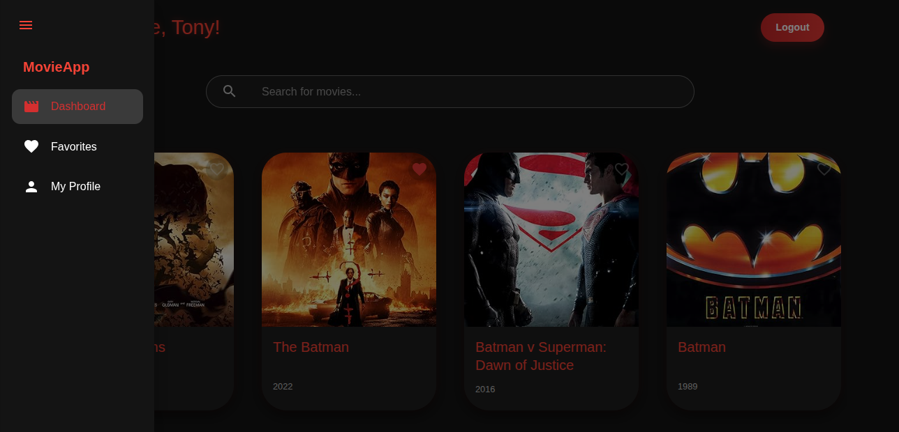
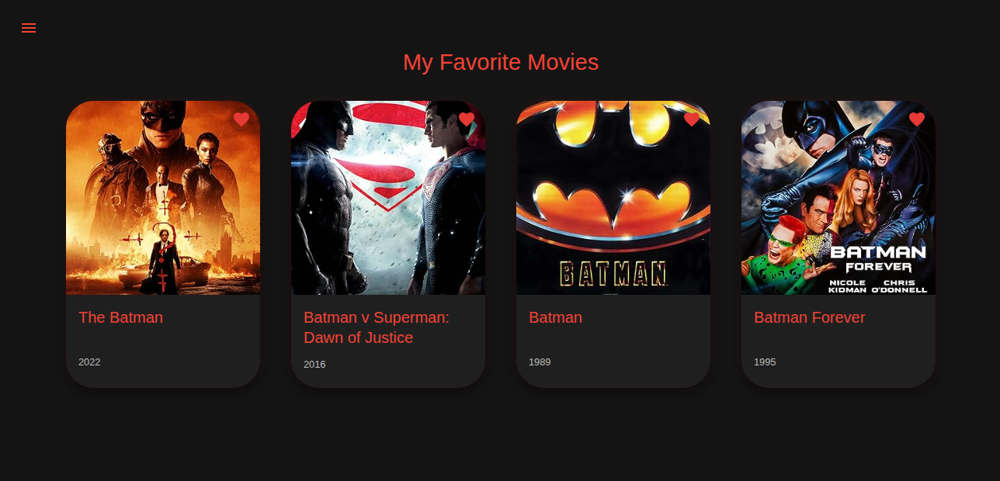
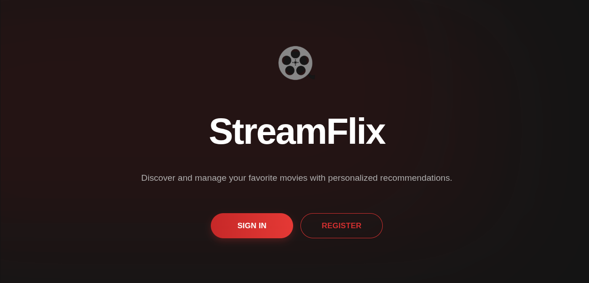
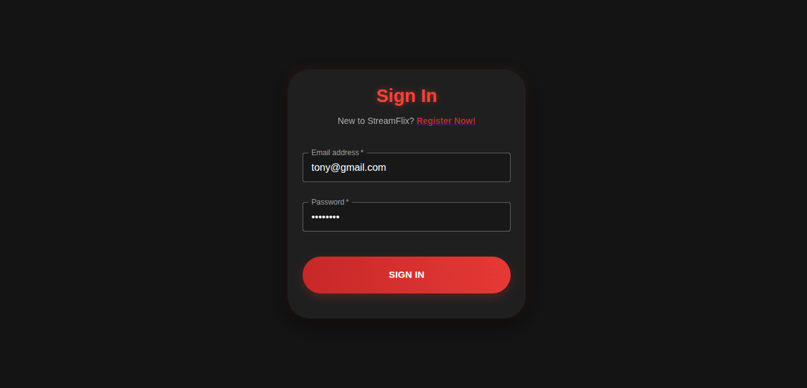
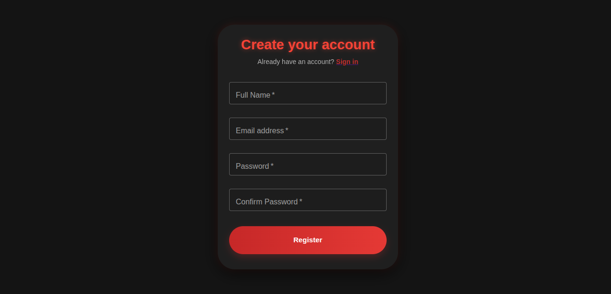

## Movie Recommendation App

A full-stack movie recommendation application built with the MERN stack (MongoDB, Express.js, React, Node.js) and containerized with Docker. Users can browse movies, search for new ones, view details, and save favorites.

### Screenshots

| Dashboard | Sidebar |
| :---: | :---: |
| \ | \ |
| **Favorites** | **Movie Details** |
| \ | \ |
| **Home Page** | **Login** |
| \ | \ |
| **Register** | |
| \ | |

-----

### Technologies Used

  * **Frontend**: React.js, Nginx
  * **Backend**: Node.js, Express.js, TypeScript
  * **Database**: MongoDB
  * **Containerization**: Docker, Docker Compose
  * **API**: OMDb API

-----

### Project Structure

  * `backend/`: Contains the Node.js/Express.js backend API.
  * `frontend/`: Contains the React.js frontend application.
  * `images/`: Stores all the screenshots for the README.
  * `docker-compose.yml`: Defines and manages the multi-container Docker application.

-----

### Getting Started

#### Prerequisites

  * Docker and Docker Compose installed on your system.

#### Installation and Setup

1.  **Clone the repository:**

    ```bash
    git clone https://github.com/5-abdulsami/movie_app.git
    cd movie_app
    ```

2.  **Configure Environment Variables:**
    The backend requires environment variables for its configuration.

      * Create a file named `.env` inside the `backend/` directory:
        ```bash
        touch backend/.env
        ```
      * Open `backend/.env` and add your specific secret keys and database connection string.
        ```
        JWT_SECRET=your_jwt_secret_here
        OMDB_API_KEY=your_omdb_api_key_here
        MONGO_URI=mongodb://mongo:27017/movie_recommendation_db
        PORT=5000
        ```

3.  **Run the application with Docker Compose:**
    From the root directory of the project, run the following command. This will build the Docker images for the frontend and backend, start all three services (backend, frontend, and MongoDB), and link them together on an isolated network.

    ```bash
    docker compose up -d --build
    ```

4.  **Access the application:**

      * **Frontend:** Open your browser and navigate to `http://localhost:3000`.
      * **Backend API:** The API is available at `http://localhost:5000/api`.

-----

### Deployment on AWS EC2

1.  **SSH into your EC2 instance** using your private key (`.pem` file).

2.  **Clone the repository** and navigate to the project directory.

3.  **Update the Backend CORS Configuration**:
    The backend's CORS middleware is configured to allow requests from `http://localhost:3000` in development. For production, you must change this to your EC2 instance's public IP address.

      * In the file `backend/src/server.ts`, find the CORS configuration and replace `https://your-frontend-domain.com` with `http://YOUR_EC2_PUBLIC_IP`.

4.  **Run the application with Docker Compose** using the same command as for local setup:

    ```bash
    docker compose up -d --build
    ```

5.  **Access the application** from your web browser using your EC2 instance's public IP address: `http://YOUR_EC2_PUBLIC_IP:3000`.
