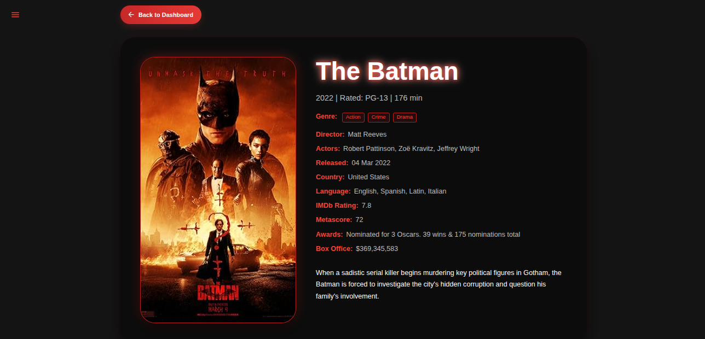

Got it — I’ll make **one clean, copy-paste-ready README.md** with everything correctly in Markdown so you can commit it directly.
Here’s your **final professional README**:

```markdown
# 🎬 Movie Recommendation App

A **full-stack movie recommendation application** built with the **MERN stack** (MongoDB, Express.js, React, Node.js) and containerized with **Docker**.  
Users can browse movies, search for new ones, view detailed information, and save favorites.

---

## 📸 Screenshots

| Dashboard | Sidebar |
| :---: | :---: |
|  |  |

| Favorites | Movie Details |
| :---: | :---: |
|  |  |

| Home Page | Login |
| :---: | :---: |
|  |  |

| Register |  |
| :---: | :---: |
|  |  |

---

## 🛠️ Technologies Used

- **Frontend:** React.js, Nginx
- **Backend:** Node.js, Express.js, TypeScript
- **Database:** MongoDB
- **Containerization:** Docker, Docker Compose
- **API:** [OMDb API](https://www.omdbapi.com/)

---

## 📂 Project Structure

```

movie\_app/
│── backend/         # Node.js/Express.js backend API
│   ├── src/         # TypeScript source code
│   ├── config/      # Database connection & config
│   ├── routes/      # API routes
│   ├── models/      # Mongoose schemas
│
│── frontend/        # React.js frontend
│   ├── src/         # Components, hooks, pages
│   ├── public/      # Static assets
│
│── images/          # Project screenshots for README
│── docker-compose.yml
│── README.md

````

---

## 🚀 Getting Started

### Prerequisites
- **Docker** and **Docker Compose** installed.

### Installation & Setup

1️⃣ **Clone the repository**
```bash
git clone <your-repo-url>
cd <your-repo-name>
````

2️⃣ **Configure Environment Variables**
In the `backend/` folder, create a `.env` file:

```bash
touch backend/.env
```

Add the following variables:

```env
JWT_SECRET=your_jwt_secret_here
OMDB_API_KEY=your_omdb_api_key_here
MONGO_URI=mongodb://mongo:27017/movie_recommendation_db
PORT=5000
```

> `MONGO_URI` is preconfigured for Docker Compose.

3️⃣ **Run with Docker Compose**

```bash
docker compose up -d --build
```

* `up` → Start containers
* `-d` → Detached mode
* `--build` → Rebuild images

4️⃣ **Access the application**

* **Frontend:** [http://localhost:3000](http://localhost:3000)
* **Backend API:** [http://localhost:5000/api](http://localhost:5000/api)

---

## ☁️ Deployment on AWS EC2

1. **SSH into EC2 instance**

```bash
ssh -i your-key.pem ubuntu@your-ec2-ip
```

2. **Clone repo & navigate**

```bash
git clone <your-repo-url>
cd <your-repo-name>
```

3. **Update Backend CORS** (`backend/src/server.ts`)

```ts
app.use(
  cors({
    origin: process.env.NODE_ENV === "production"
      ? ["http://YOUR_EC2_PUBLIC_IP"]
      : ["http://localhost:3000"],
    credentials: true,
  })
);
```

4. **Run Docker Compose**

```bash
docker compose up -d --build
```

5. **Access via EC2 public IP**

```
http://YOUR_EC2_PUBLIC_IP:3000
```
